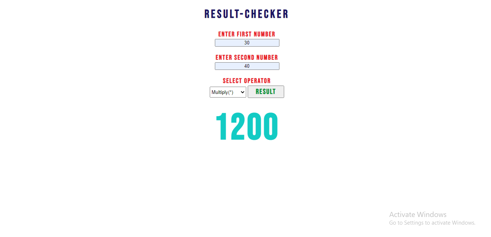

# CALCULATOR WEBSITE  

<h3> 📝📝 DESCRIPTION</h3>
  

It's a simple calculator website built with php.I practiced if else and switch case in this project.You can do addition,subtraction,Multipication and division between two numbers in this website.🙆‍♂️🙆‍♂️

<h3>🛠🛠 TOOLS</h3>
<ul>
  <li><h5>HTML5</h5></li>
  <li><h5>CSS3</h5></li>
  <li><h5>PHP</h5></li>
</ul>
  
### 🎨PREVIEW 

 <h3>🔗🔗INSTALLATION</h3>

You have put this folder in local-server to see the live preview

